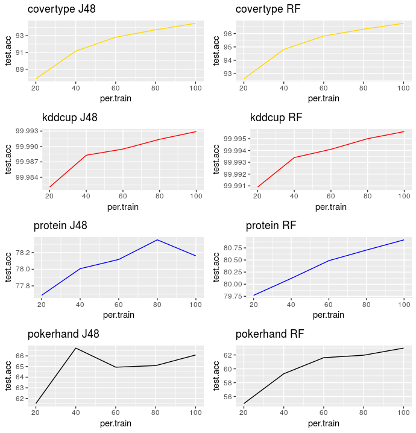
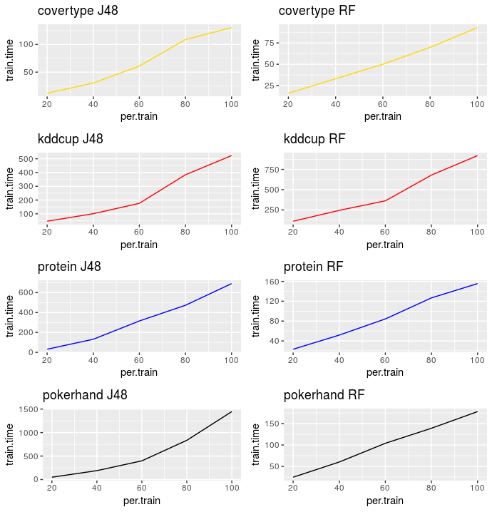

# statististical-stuff
Statistical Learning material

## Scalability

Big Data algorithms study including comparison of times and accuracies of J48 and Random Forest when we increase the amount of training instances.

